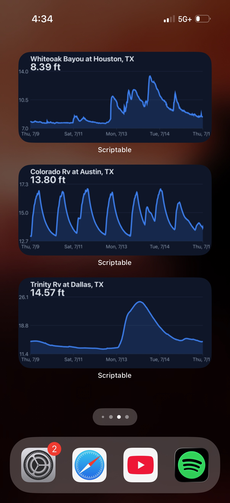

# Creek Gauge (USGS Hydrograph Widget)

   📥
**[Get the script](creek-gauge.js)** · requires **[Scriptable](https://apps.apple.com/app/scriptable/id1405459188)** (free)

A home screen widget that charts a USGS river or creek gauge over the last
7 days, with the current reading called out. Works with **any** USGS gauge in
the country — set the site number per widget, so you can run several at once for
different waterways.

  

## **Setup**

1. Install **[Scriptable](https://apps.apple.com/app/scriptable/id1405459188)**
   from the App Store.
2. Open Scriptable → tap **+** (top-right) to create a new script.
3. Paste in the contents of [`creek-gauge.js`](creek-gauge.js) and name it
   **Creek Gauge**.
4. Long-press your home screen → **+** → search **Scriptable** → add a
   **Medium** widget.
5. Long-press the new widget → **Edit Widget**, then set:
   - **Script** → `Creek Gauge`
   - **Parameter** → your USGS site number (e.g. `08155300`)
6. *(Optional)* Leave **Parameter** blank to use the default site baked into the
   script (`08158000` — Colorado Rv at Austin, TX).

### **Finding your site number**

Look up any gauge on the
[USGS National Water Dashboard](https://dashboard.waterdata.usgs.gov/) or
[USGS Water Data](https://waterdata.usgs.gov/nwis/rt). The site number is the
8-digit (sometimes longer) ID in the station listing — that's the value the
widget's **Parameter** field wants.

Not every gauge reports every measurement. If a site has no gauge height data,
the widget will say so rather than render an empty chart.

### **Texas gauges to try**

All verified active and reporting gauge height — drop any of these into the
widget's **Parameter** field:

| Site number | Gauge | Where |
| --- | --- | --- |
| `08158000` | Colorado Rv at Austin | Austin *(default)* |
| `08155300` | Barton Ck at Loop 360 | Austin |
| `08057000` | Trinity Rv at Dallas | Dallas |
| `08074500` | Whiteoak Bayou at Houston | Houston |
| `08178050` | San Antonio Rv at Mitchell St | San Antonio |
| `08168500` | Guadalupe Rv abv Comal Rv | New Braunfels |
| `08167000` | Guadalupe Rv at Comfort | Hill Country |
| `08111500` | Brazos Rv nr Hempstead | Brazos Valley |
| `08116650` | Brazos Rv nr Rosharon | SE of Houston |
| `08447000` | Pecos Rv nr Sheffield | West Texas |

Barton Creek and the Pecos both run low or intermittent in dry spells — good for
exercising the flat-line and sparse-data paths, less good as an everyday widget.

### **Compatibility**

Medium widget only. The chart canvas is drawn at a 600×280 aspect ratio, so
small and large widgets will letterbox or crop.

## **Usage**

**Intended Use:**
Keep an eye on creek and river levels from the home screen — useful for
paddling, fishing, or watching a rise ahead of high water, without opening the
USGS site and hunting for the gauge.

**Configuration** *(edit the constants at the top of the script):*

| Constant | Default | What it does |
| --- | --- | --- |
| `SITE` | `08158000` | Fallback site when the widget **Parameter** is empty. |
| `PARAM` | `00065` | `00065` = gauge height (ft). Change to `00060` for discharge (cfs). |
| `HOURS` | `168` | Lookback window, in hours. `168` = 7 days. |
| `LINE_COLOR` / `FILL_COLOR` | blue | Chart line and the shaded area beneath it. |
| `BG_COLOR` / `TEXT_COLOR` / `MUTED_COLOR` | slate | Widget background and label colors. |

Run the script inside Scriptable to preview it without touching the home
screen — it renders the same medium widget in-app.

---

## **Potential Improvements**

- [ ] Overlay NWS flood stage thresholds (action / flood / moderate / major).
- [ ] Show the trend delta over the window, not just the latest reading.
- [ ] Light mode support — the palette is currently dark-only.

---

## **How It Works**

1. **Resolve the site**
   - Reads the USGS site number from the widget's **Parameter** field.
   - Falls back to the `SITE` constant when no parameter is set.
2. **Fetch readings**
   - Calls the USGS Water Services *instantaneous values* API for the last
     `HOURS` hours of parameter `PARAM`.
   - Discards unparseable points and USGS's `-999999` "no value" sentinel.
   - Bails out with an on-widget message on a network error, an unknown site,
     or fewer than 2 usable points.
3. **Scale the plot**
   - Derives the time and value ranges from the data itself, padding the value
     axis by 10% so the line never touches the edge.
   - Guards the flat-line case (every reading identical) that would otherwise
     divide by zero.
4. **Draw the chart**
   - Renders to a `DrawContext` at 600×280 for crispness on retina screens.
   - Draws gridlines and value labels, the shaded area, the line, and dated
     day ticks along the x-axis.
   - Titles it with the station name USGS reports, plus the latest reading and
     its unit.
5. **Render the widget**
   - Fills a medium `ListWidget` with the chart image.
   - Sets a refresh hint — iOS treats this as a suggestion, not a guarantee,
     and budgets widget refreshes on its own.

## **Data Source**

[USGS Water Services](https://waterservices.usgs.gov/) — public, no API key
required. Please be considerate with refresh rates.
