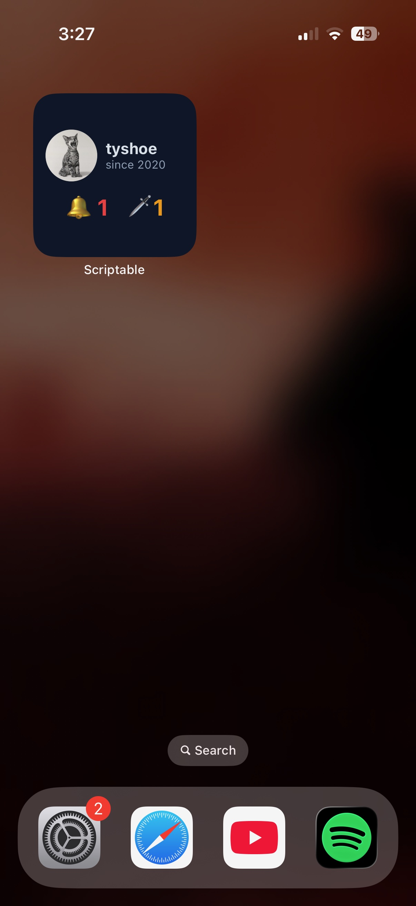

# Speedrun Profile (speedrun.com Widget)

<font size="5">   📥
**[Get the script](speedrun-profile.js)** · requires **[Scriptable](https://apps.apple.com/app/scriptable/id1405459188)** (free)
</font>

A small home screen widget for [speedrun.com](https://www.speedrun.com) that
shows your avatar and username alongside two live counts: **unread
notifications** and, if you're a game moderator, **runs waiting in your
verification queue**. Tap it to jump straight to the site.

<div align="center">
  
</div>

## **Setup**

1. Install **[Scriptable](https://apps.apple.com/app/scriptable/id1405459188)**
   from the App Store.
2. Open Scriptable → tap **+** (top-right) to create a new script.
3. Paste in the contents of [`speedrun-profile.js`](speedrun-profile.js) and
   name it **Speedrun Profile**.
4. **Run it once inside the app** (the ▶ button). It will prompt for your API
   key — see below — and store it. You must do this before adding the widget;
   a widget can't show the key prompt.
5. Long-press your home screen → **+** → search **Scriptable** → add a
   **Small** widget.
6. Long-press the new widget → **Edit Widget**, then set:
   - **Script** → `Speedrun Profile`
   - **Parameter** → your speedrun.com **user ID** — see
     [Finding your user ID](#finding-your-user-id) below.

The **Parameter** is required. Until you set it, the widget just shows a hint
reminding you to add your user ID.

### **Getting your API key**

The unread-notifications count is private, so it needs your key:

1. Log into speedrun.com and open your API settings at
   `speedrun.com/users/<username>/settings/api` (replace `<username>` with
   yours). You can also get there via **Settings → API** on your profile.
2. Generate a key if you don't have one, then copy it.
3. On the script's first in-app run, paste it into the prompt.

The key is stored in the iOS **Keychain** on your device — never in the script,
and never anywhere this repo can see it. To change it later, delete and
re-add the script, or clear the `srcom_api_key` entry.

> **Note:** the notification count needs the key. The avatar, username, and
> moderation queue all use public endpoints, so the widget still renders
> without it — the bell just shows `—` instead of a number.

### **Finding your user ID**

The widget's **Parameter** wants your speedrun.com **user ID** — a short
8-character code — *not* your username. Your username won't work directly, but
it's how you look the ID up.

**Your username** is your public display name on speedrun.com — the one you log
in with and that appears at `speedrun.com/user/<username>`. If you don't know
it, it's shown on your profile page after you log in.

**To turn that username into your user ID**, open this URL in any browser,
replacing `YOUR_USERNAME`:

```
https://www.speedrun.com/api/v1/users?lookup=YOUR_USERNAME
```

In the response, copy the value of the `"id"` field near the top (it looks like
`"id": "..."` with an 8-character code). That code is what goes in the widget's
**Parameter** field.

> Tip: on iPhone, open the URL in Safari and use ⌘F / "Find on Page" for `"id"`
> if the raw JSON is hard to scan.

### **Compatibility**

Small widget only. Run it in-app and it previews as a small widget via
`presentSmall()`.

## **Usage**

**Intended Use:**
Keep an eye on your speedrun.com activity from the home screen — new
notifications, and the size of your moderation backlog — without opening the
site to check.

**What the widget shows:**

| Element | Meaning |
| --- | --- |
| Avatar + name | From your public profile. Falls back to a colored initial if you have no avatar. |
| `since YYYY` | The year you signed up. |
| 🔔 count | Unread notifications. Red when > 0, muted when zero, `—` without an API key. |
| 🗡️ count | Runs sitting in the "new" (unverified) queue across every game you moderate. Hidden if zero; shows `200+` if a single game's queue exceeds one page. |

**Configuration** *(edit the constants at the top of the script):*

| Constant | Default | What it does |
| --- | --- | --- |
| `USER_ID` | *(widget Parameter)* | Your speedrun.com user ID. Comes from the widget's **Parameter** field; there is no built-in default. |
| `KEYCHAIN_KEY` | `srcom_api_key` | Keychain entry the API key is stored under. |
| `ACCENT_COLOR` | amber | Accent used for the moderation count and avatar fallback. |
| `BG_COLOR` / `TEXT_COLOR` / `MUTED_COLOR` | slate | Widget background and label colors. |

---

## **Potential Improvements**

- [ ] Support medium/large sizes with a list of recent notifications.
- [ ] Show a breakdown of the moderation queue per game.
- [ ] Surface personal-best or recent-run info from the profile.

---

## **How It Works**

1. **Resolve the user**
   - Reads the speedrun.com user ID from the widget's **Parameter** field.
   - If no parameter is set, the widget shows a setup hint instead.
2. **Load the API key**
   - Reads it from the Keychain. If it's missing and the script is running
     in-app, it prompts once and saves it; a widget can't prompt, so it
     renders without the notification count.
3. **Fetch, in parallel where possible**
   - **Profile** (public) → avatar, username, signup year, name color.
   - **Notifications** (needs the key) → counts the unread ones.
   - **Moderated games** (public) → then sums the "new" run queue across all
     of them, fetched concurrently.
   - Every fetch is wrapped so one failing endpoint degrades gracefully
     instead of blanking the whole widget.
4. **Render the widget**
   - Header: circular avatar (or a colored-initial fallback) beside the name
     and signup year.
   - Stats row: the unread bell, plus the moderation count when it's non-zero.
   - Sets a ~once-a-day refresh hint and a tap target to speedrun.com.

## **Data Source**

[speedrun.com API v1](https://github.com/speedruncomorg/api) — public endpoints
for profile and moderation data; your personal API key for notifications. Please
be considerate with refresh rates.
